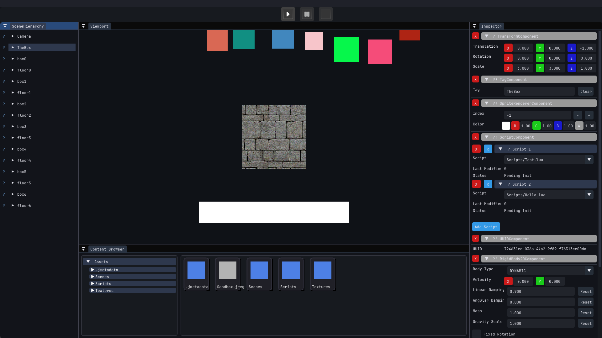

<h3 align="center">📽️ Demo</h3>

  

<h3 align="center">Jupiter</h3>

  Jupiter Game Engine
   
  <a href="https://github.com/krnl32/Jupiter/issues/new?labels=bug">Report bug</a>
  ·
  <a href="https://github.com/krnl32/Jupiter/issues/new?labels=feature">Request feature</a>

## About

Jupiter Game Engine an upcoming Game Engine.

## Features

- ....

## Build
Please read through our [building guidelines](https://github.com/krnl32/jupiter/blob/master/BUILDING.md).

## Bugs and feature requests

Have a bug or a feature request? Please first read the [issue guidelines](https://github.com/krnl32/jupiter/blob/master/CONTRIBUTING.md) and search for existing and closed issues. If your problem or idea is not addressed yet, [please open a new issue](https://github.com/krnl32/jupiter/issues/new).

## Contributing

Please read through our [contributing guidelines](https://github.com/krnl32/jupiter/blob/master/CONTRIBUTING.md). Included are directions for opening issues, coding standards, and notes on development.
## Authors

- [**krnl32**](https://github.com/krnl32)

## License

Jupiter is Licensed under the [GPL-3 License](https://github.com/krnl32/jupiter/blob/master/LICENSE.txt).
